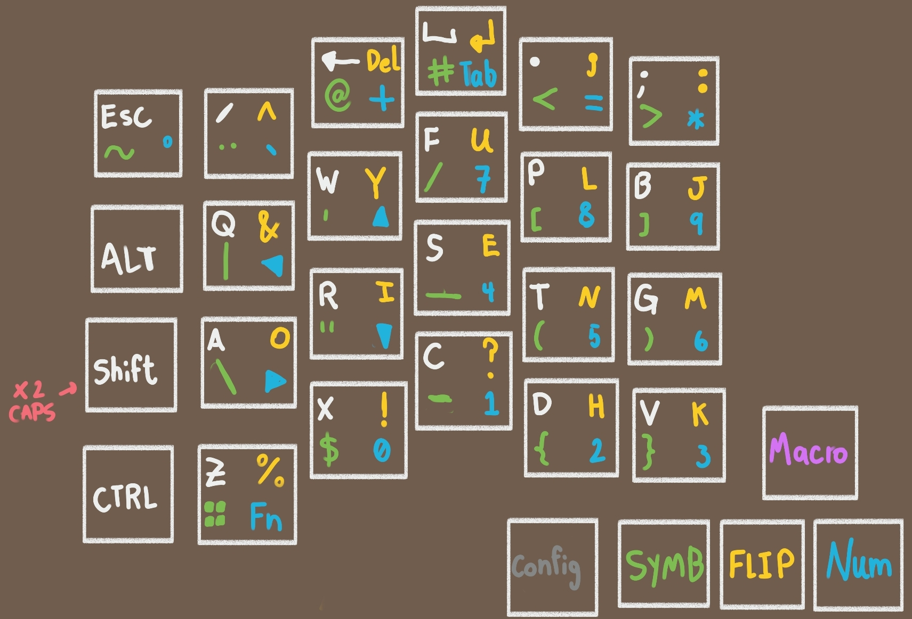

# Keyboard Layout

Based on Colemak-Mod-DH
We use 3 thumb buttons for layer shifts.
- **Flip:** for the right-side alpha keys
- **Num:** for the number and arrow keys
- **Symb:** for other symbols

I don't know what to use the other thumb buttons for. I guess volume, bluetooth and macros for Blender? 

  

